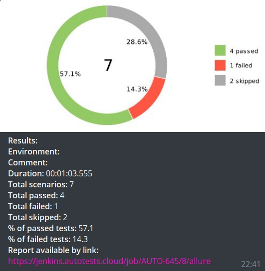

[](https://git.io/typing-svg)

# Проект по автоматизации тестирования для [Tourmachine](https://www.tourmachine.net/) :paw_prints:

## :raccoon:Содержание:

:cookie: Технологии и инструменты

:cookie: Реализованные проверки

:cookie: Сборка в Jenkins

:cookie: Запуск из терминала

:cookie: Allure отчет

:cookie: Отчет в Telegram

:cookie: Видео примеры прохождения тестов


## :raccoon: Технологии и инструменты

<p align="center">
<a href="https://www.jetbrains.com/idea/"></a>
<a href="https://www.java.com/"></a>
<a href="https://github.com/"></a>
<a href="https://junit.org/junit5/"></a>
<a href="https://gradle.org/"></a>
<a href="https://selenide.org/"></a>
<a href="https://aerokube.com/selenoid/"></a>
<a href="https://github.com/allure-framework/allure2"></a>
<a href="https://github.com/allure-framework/allure2"></a>
<a href="https://www.jenkins.io/"></a>
 <a href="https://telegram.org/"></a>
</p>


## :raccoon: Реализованные проверки

:cookie: Проверка заголовка главной страницы

:cookie: Проверка состава путешественников по-умолчанию

:cookie: Проверка кнопки 'Витрина впечатлений'

:cookie: Проверка плейсхолдера 'Куда хотите поехать?'

:cookie: Проверка ошибок в консоле

## </a> Jenkins <a target="_blank" href="https://jenkins.autotests.cloud/job/AUTO-645/"> job </a>
<p align="center">
<a href="https://jenkins.autotests.cloud/job/AUTO-645/"></a>
</p>

## :raccoon: Параметры сборки в Jenkins:

:cookie: browser (браузер, по умолчанию chrome)

:cookie: version (версия браузера, по умолчанию 91.0)

:cookie: size (размер окна браузера, по умолчанию 1920x1080)

:cookie: remoteUrl (логин, пароль и адрес удаленного сервера selenoid)


## :raccoon: Запуск тестов из терминала

:cookie: Локальный запуск:
```bash
gradle clean test
```

:cookie: Удаленный запуск:
```bash
clean
test
-Dbrowser=${BROWSER}
-Dversion=${VERSION}
-Dsize=${BROWSER_SIZE}
-Durl=${REMOTE_URL}
```

## </a> Отчет в <a target="_blank" href="https://jenkins.autotests.cloud/job/AUTO-645/8/allure/">Allure report</a>
### :cookie: Основное окно

<p align="center">

</p>

### :cookie: Тесты

<p align="center">

</p>

## </a> Уведомление в Telegram при помощи бота

<p align="center">

</p>


## </a> Видео прохождения теста

<p align="center">
 
</p>
